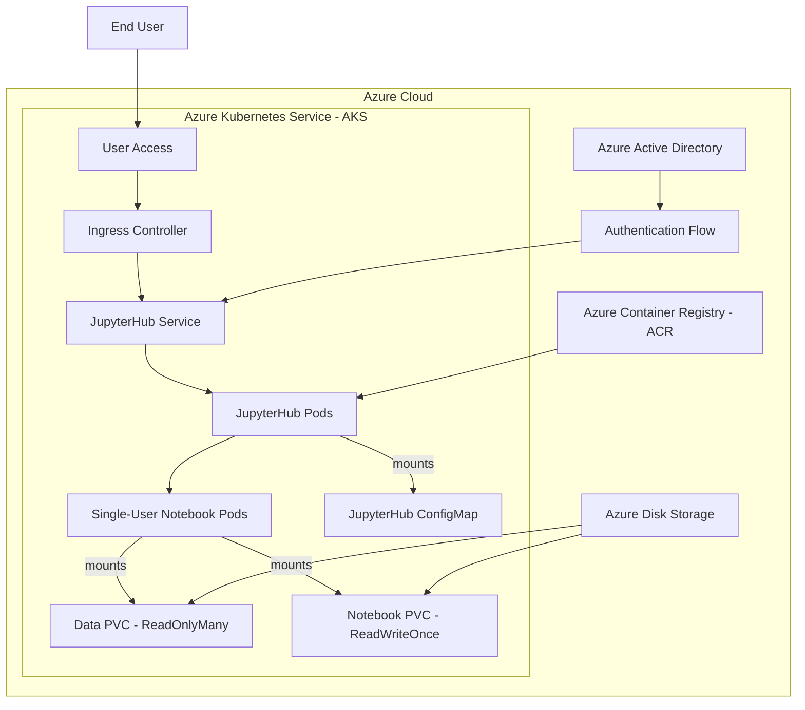
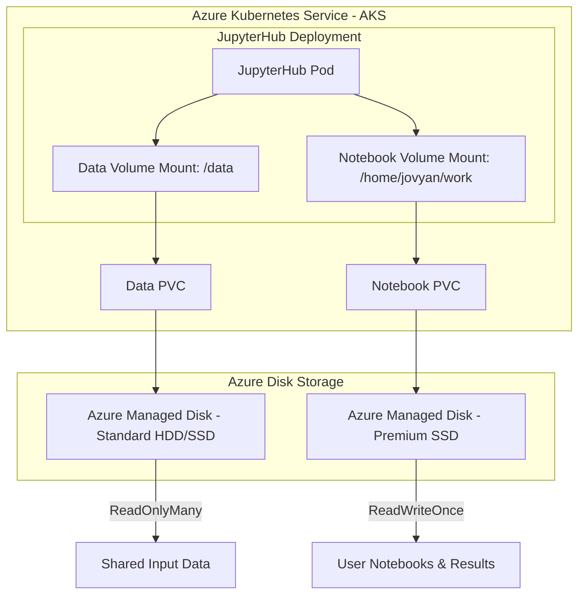
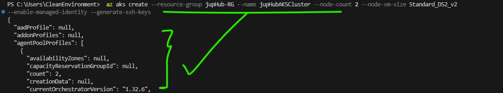

# Deploying JupyterHub with Helm on Azure Kubernetes Service (AKS)

## Project Title and Summary

In This document, I will provide a guide for deploying the JupyterHub Helm chart provided in this repository on Microsoft Azure Kubernetes Service (AKS). This solution utilizes a dual Persistent Volume Claim (PVC) architecture for efficient data management and robust persistent storage, and thus qualifies for an ideal method for data science teams which requires a scalable and secure environment for their Jupyter notebooks and data processing tasks. 

This guide covers the entire lifecycle, from Azure resource provisioning to Helm chart deployment and post-deployment validation, also, it adheres to Helm best practices and Azure best practices for cloud-native applications.

## Tech Stack and Tools Used

This deployment uses a modern cloud-native technology stack to provide a robust and scalable JupyterHub environment:

- **Kubernetes**: The container orchestration platform, specifically Azure Kubernetes Service (AKS), for managing the deployment, scaling, and operations of application containers.
- **Helm**: The package manager for Kubernetes, used to define, install, and upgrade the complex JupyterHub application and its dependencies.
- **JupyterHub**: The multi-user Hub that spawns, manages, and proxies single-user Jupyter notebook servers.
- **Azure Kubernetes Service (AKS)**: Microsoft's managed Kubernetes service, that helps us simplify the deployment, management, and operations of our Kubernetes clusters.
- **Azure Container Registry (ACR)**: This is a managed, private Docker registry service in Azure, and is used for storing and managing container images.
- **Azure Disk Storage**: Persistent block storage for Azure Virtual Machines, providing the underlying persistent volumes for JupyterHub's data and notebook storage.
- **Azure CLI / Azure PowerShell**: Command-line tools for managing Azure resources.
- **kubectl**: The Kubernetes command-line tool for interacting with Kubernetes clusters.

## Diagrams

To illustrate the deployment architecture on Azure, the following diagrams are provided.

### Overall Architecture Diagram




**Explanation:**

- **Azure Kubernetes Service (AKS)**: The core of the deployment, hosting all Kubernetes resources.
- **Ingress Controller**: Manages external access to JupyterHub, routing traffic from users.
- **JupyterHub Service**: Exposes the JupyterHub application within the cluster.
- **JupyterHub Pods**: Run the JupyterHub application logic.
- **Single-User Notebook Pods**: Dynamically spawned for each user, hosting their individual Jupyter environments.
- **JupyterHub ConfigMap**: Provides configuration to the JupyterHub application.
- **Data PVC (ReadOnlyMany)**: Persistent Volume Claim for shared, read-only input data, backed by Azure Disk Storage.
- **Notebook PVC (ReadWriteOnce)**: Persistent Volume Claim for user notebooks and results, backed by Azure Disk Storage.
- **Azure Container Registry (ACR)**: Stores the Docker images for JupyterHub and single-user notebooks.
- **Azure Disk Storage**: Provides the actual persistent storage for the PVCs.
- **Azure Active Directory**: Can be integrated for enhanced authentication (optional enhancement).

### Storage Architecture Diagram




**Explanation:**

- **JupyterHub Pod**: The running instance of JupyterHub or a single-user notebook server.
- **Data Volume Mount (`/data`)**: The mount point for the read-only data volume.
- **Notebook Volume Mount (`/home/jovyan/work`)**: The mount point for the read-write notebook volume.
- **Data PVC**: The Persistent Volume Claim requesting storage for input data.
- **Notebook PVC**: The Persistent Volume Claim requesting storage for user notebooks.
- **Azure Managed Disk - Standard HDD/SSD**: The underlying Azure Disk type for the data volume, typically cost-optimized.
- **Azure Managed Disk - Premium SSD**: The underlying Azure Disk type for the notebook volume, typically performance-optimized.
- **Shared Input Data**: The actual data stored on the read-only volume.
- **User Notebooks & Results**: The actual data stored on the read-write volume.

## Prerequisites

Before we begin, we should ensure that we have the following installed and configured:

- **Azure Subscription**: An active Azure subscription.
- **Azure CLI**: Version 2.0.71 or later. [Installation Guide](https://docs.microsoft.com/en-us/cli/azure/install-azure-cli)
- **kubectl**: Version 1.19 or later. [Installation Guide](https://kubernetes.io/docs/tasks/tools/install-kubectl/)
- **Helm**: Version 3.0 or later. [Installation Guide](https://helm.sh/docs/intro/install/)
- **Git**: For cloning the Helm chart repository.

## Azure Resource Provisioning

This section guides us through provisioning the necessary Azure resources for our AKS cluster.

### 1. Log in to Azure 

```bash
az login --use-device-code
```


</br>
*Fig: Setting up the terminal for communicating with our Azure Platform.*

### 2. Set Your Azure Subscription (if you have multiple)

```bash
az account set --subscription "Your Subscription Name or ID"
```

### 3. Create an Azure Resource Group

A resource group is a logical container for Azure resources.

```bash
az group create --name jupHub-RG --location eastus
```

### 4. Create an Azure Kubernetes Service (AKS) Cluster

This command creates an AKS cluster with a system-assigned managed identity, enabling easy integration with other Azure services. Adjust node count and size as needed.

```bash
az aks create \
    --resource-group jupHub-RG \
    --name jupHub-AKSCluster \
    --node-count 2 \
    --node-vm-size Standard_DS2_v2 \
    --enable-managed-identity \
    --generate-ssh-keys
```

*Fig: Creating Azure Kubernetes Cluster.*

### 5. Get AKS Cluster Credentials

Configure `kubectl` to connect to our new AKS cluster.

```bash
az aks get-credentials --resource-group jupHub-RG --name jupHub-AKSCluster
```

Verify your connection:
 
```bash
kubectl get nodes 
```
</br>
*Fig: Viewing the nodes in our newly created AKS Cluster*

### 6. Create an Azure Container Registry (ACR)

ACR will host our container images. Replace `juphubacrregistry` with a globally unique name. 

```bash
az acr create --resource-group jupHub-RG --name juphubacrregistry --sku Basic
```
> 
> </br>
> ⚠️ **_I could not maintain the naming convention here, because I was prompted by the az-cli, informing me that creating this container registry requires an all lower-case name type_**

### 7. Attach ACR to AKS Cluster (Optional, but Recommended)

This allows our AKS cluster to pull images from ACR without additional authentication steps.

```bash
az aks update -n jupHub-AKSCluster -g jupHub-RG --attach-acr juphubacrregistry
``` 
</br>
*Fig: Attaching Azure Container Registry*
