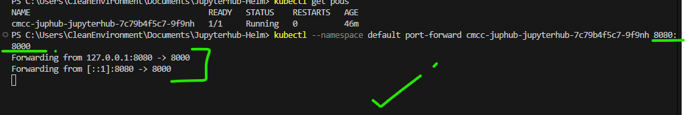
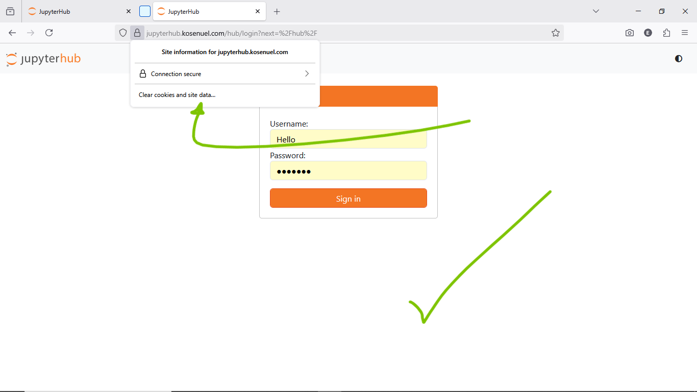

# Deploying JupyterHub with Helm on Azure Kubernetes Service (AKS)

## Project Title and Summary

In This document, I will provide a guide for deploying the JupyterHub Helm chart provided in this repository on Microsoft Azure Kubernetes Service (AKS). This solution utilizes a dual Persistent Volume Claim (PVC) architecture for efficient data management and robust persistent storage, and thus qualifies for an ideal method for data science teams which requires a scalable and secure environment for their Jupyter notebooks and data processing tasks. 

This guide covers the entire lifecycle, from Azure resource provisioning to Helm chart deployment and post-deployment validation, also, it adheres to Helm best practices and Azure best practices for cloud-native applications.

## Tech Stack and Tools Used

This deployment uses a modern cloud-native technology stack to provide a robust and scalable JupyterHub environment:

- **Kubernetes**: The container orchestration platform, specifically Azure Kubernetes Service (AKS), for managing the deployment, scaling, and operations of application containers.
- **Helm**: The package manager for Kubernetes, used to define, install, and upgrade the complex JupyterHub application and its dependencies.
- **JupyterHub**: The multi-user Hub that spawns, manages, and proxies single-user Jupyter notebook servers.
- **Azure Kubernetes Service (AKS)**: Microsoft's managed Kubernetes service, that helps us simplify the deployment, management, and operations of our Kubernetes clusters.
- **Azure Container Registry (ACR)**: This is a managed, private Docker registry service in Azure, and is used for storing and managing container images.
- **Azure Disk Storage**: Persistent block storage for Azure Virtual Machines, providing the underlying persistent volumes for JupyterHub's data and notebook storage.
- **Azure CLI / Azure PowerShell**: Command-line tools for managing Azure resources.
- **kubectl**: The Kubernetes command-line tool for interacting with Kubernetes clusters.

## Diagrams

To illustrate the deployment architecture on Azure, the following diagrams are provided.

### Overall Architecture Diagram


**Explanation:**

- **Azure Kubernetes Service (AKS)**: The core of the deployment, hosting all Kubernetes resources.
- **Ingress Controller**: Manages external access to JupyterHub, routing traffic from users.
- **JupyterHub Service**: Exposes the JupyterHub application within the cluster.
- **JupyterHub Pods**: Run the JupyterHub application logic.
- **Single-User Notebook Pods**: Dynamically spawned for each user, hosting their individual Jupyter environments.
- **JupyterHub ConfigMap**: Provides configuration to the JupyterHub application.
- **Data PVC (ReadOnlyMany)**: Persistent Volume Claim for shared, read-only input data, backed by Azure Disk Storage.
- **Notebook PVC (ReadWriteOnce)**: Persistent Volume Claim for user notebooks and results, backed by Azure Disk Storage.
- **Azure Container Registry (ACR)**: Stores the Docker images for JupyterHub and single-user notebooks.
- **Azure Disk Storage**: Provides the actual persistent storage for the PVCs.
- **Azure Active Directory**: Can be integrated for enhanced authentication (optional enhancement).

### Storage Architecture Diagram


**Explanation:**

- **JupyterHub Pod**: The running instance of JupyterHub or a single-user notebook server.
- **Data Volume Mount (`/data`)**: The mount point for the read-only data volume.
- **Notebook Volume Mount (`/home/jovyan/work`)**: The mount point for the read-write notebook volume.
- **Data PVC**: The Persistent Volume Claim requesting storage for input data.
- **Notebook PVC**: The Persistent Volume Claim requesting storage for user notebooks.
- **Azure Managed Disk - Standard HDD/SSD**: The underlying Azure Disk type for the data volume, typically cost-optimized.
- **Azure Managed Disk - Premium SSD**: The underlying Azure Disk type for the notebook volume, typically performance-optimized.
- **Shared Input Data**: The actual data stored on the read-only volume.
- **User Notebooks & Results**: The actual data stored on the read-write volume.

## Prerequisites

Before we begin, we should ensure that we have the following installed and configured:

- **Azure Subscription**: An active Azure subscription.
- **Azure CLI**: Version 2.0.71 or later. [Installation Guide](https://docs.microsoft.com/en-us/cli/azure/install-azure-cli)
- **kubectl**: Version 1.19 or later. [Installation Guide](https://kubernetes.io/docs/tasks/tools/install-kubectl/)
- **Helm**: Version 3.0 or later. [Installation Guide](https://helm.sh/docs/intro/install/)
- **Git**: For cloning the Helm chart repository.

## Azure Resource Provisioning

This section guides us through provisioning the necessary Azure resources for our AKS cluster.

### 1. Log in to Azure 

```bash
az login --use-device-code
```


</br>
*Fig: Setting up the terminal for communicating with our Azure Platform.*

### 2. Set Your Azure Subscription (if you have multiple)

```bash
az account set --subscription "Your Subscription Name or ID"
```

### 3. Create an Azure Resource Group

A resource group is a logical container for Azure resources.

```bash
az group create --name jupHub-RG --location eastus
```

### 4. Create an Azure Kubernetes Service (AKS) Cluster

This command creates an AKS cluster with a system-assigned managed identity, enabling easy integration with other Azure services. Adjust node count and size as needed.

```bash
az aks create --resource-group jupHub-RG --name jupHub-AKSCluster --node-count 2 --node-vm-size Standard_D4s_v3 --enable-managed-identity --generate-ssh-keys
```

### 5. Get AKS Cluster Credentials

Configure `kubectl` to connect to our new AKS cluster.

```bash
az aks get-credentials --resource-group jupHub-RG --name jupHub-AKSCluster
```

Verify your connection:
 
```bash
kubectl get nodes 
```
</br>
*Fig: Viewing the nodes in our newly created AKS Cluster*

### 6. Create an Azure Container Registry (ACR)

ACR will host our container images. Replace `juphubacrregistry` with a globally unique name. 

```bash
az acr create --resource-group jupHub-RG --name juphubacrregistry --sku Basic
```
> 
> </br>
> ⚠️ **_I could not maintain the naming convention here, because I was prompted by the az-cli which informed  me that creating this container registry requires an all lower-case name type_**

### 7. Attach ACR to AKS Cluster (Optional, but Recommended)

This allows our AKS cluster to pull images from ACR without additional authentication steps.

```bash
az aks update -n jupHub-AKSCluster -g jupHub-RG --attach-acr juphubacrregistry
``` 
</br>
*Fig: Attaching Azure Container Registry*

## Helm Chart Deployment on AKS

This section details how to deploy the JupyterHub Helm chart to your newly provisioned AKS cluster.

### 1. Navigate into the Helm Chart Directory

After you have successfully cloned this helm chart provided in this repository into your environment, navigate into the chart's directory

```bash
cd jupyterhub-chart
```

### 2. Customize the `values.yaml` for Azure (or the infrastructure environment of your choice)

Open the `values.yaml` file in the `jupyterhub-chart` directory and make the following adjustments to optimize for Azure Disk storage, other Azure-specific configurations and modify other specifications as you see fit.

**Example `values.yaml` adjustments:**

```yaml
persistence:
  dataVolume:
    # Use a storage class suitable for read-only data, I use 'azurefile' here because it supports "ROX" (Read only many)
    storageClass: "azurefile"
    # Ensure the accessModes is ReadOnlyMany for shared data
    accessModes:
      - ReadOnlyMany
    size: 5Gi
    mountPath: /data

  notebookVolume:
    # Use a performance-optimized storage class, in my case, I used 'managed-csi-premium'
    storageClass: "managed-csi-premium"
    #  Ensure the accessModes here is set to ReadWriteOnce for individual user notebooks
    accessModes:
      - ReadWriteOnce
    size: 20Gi
    mountPath: /home/jovyan/work

# Enable Ingress for external access
ingress:
  enabled: true
  className: "nginx"
  annotations:

  hosts:
    - host: jupyterhub.kosenuel.com # You can replace this with your actual domain
      paths:
        - path: /
          pathType: Prefix
  tls:
    - secretName: jupyterhub-tls # Kubernetes secret for TLS certificate
      hosts:
        - jupyterhub.kosenuel.com # you can replace this with your actual domain

# Resource requests and limits for JupyterHub pods
jupyterhub:
  resources:
    limits:
      cpu: 1000m
      memory: 2Gi
    requests:
      cpu: 500m
      memory: 512Mi
  # Security context for running as non-root (best practice)
  securityContext:
    runAsNonRoot: true
    runAsUser: 1000
    runAsGroup: 1000
    fsGroup: 1000

```

### 3. Install the Helm Chart

Navigate to the root directory of your Helm chart (`jupyterhub-chart`) and install it.

```bash
helm install cmcc-juphub ./
```
</br>
*Fig: Installing our jupyterhub helm chart*

To verify the installation:

```bash
helm list
```
</br>
*Fig: Viewing the helm release(s)*

### 4. Verify Kubernetes Resources

Check the status of your deployed resources:

```bash
kubectl get pods
kubectl get svc -n ingress-nginx
kubectl get pvc
kubectl get deployment
kubectl get ingress 
```
Ensure all pods are running and PVCs are bound.

</br>
*Fig: Viewing the deployed resources in our AKS Cluster*


## Accessing JupyterHub on Azure
### 1. Using Port Forwarding (for testing/development)

If you haven't configured Ingress, you can access JupyterHub via port forwarding:

```bash
# for bash
kubectl get pods
kubectl --namespace default port-forward $POD_NAME 8080:8000
```
</br>
*Fig: Forwarding local-port to k8s service port*
 
 
Then, open your web browser and navigate to `http://127.0.0.1:8080`.

</br>
*Fig: Accessing Jupyterhub via webui*
### 2. Using Ingress (for production)

If you enabled Ingress, you would need to configure DNS for your chosen hostname (`jupyterhub.kosenuel.com` in my case) to point to the Ingress Controller's external IP address. You can get the Ingress external IP by following the commands below:

```bash
kubectl get ingress cmcc-juphub-jupyterhub -o jsonpath='{.status.loadBalancer.ingress[0].ip}'
```
</br>
*Fig: Getting the Ingress external IP*
  
Once DNS is propagated, navigate to `http://jupyterhub.kosenuel.com` (your configured domain) in your web browser.
</br>
*Fig: Accessing the JupyterHub Web UI* 

### Login Credentials

With the default Dummy Authenticator:
- **Username**: Any username (e.g., "admin", "user", etc.)
- **Password**: `jupyter` (or your configured password in `values.yaml`)
</br>
*Fig: Jupyterhub Home Page*

## Post-Deployment Validation and Best Practices
 
### 0. Running Helm Tests
#### Run `Helm Lint`
Before deploying, to check the correctness of your chart, it is recommended to run this command against your chart:
```bash
helm lint <your chart (which is cmcc-juphub in my case)>
```
</br>
</br>
*Fig: Viewing the nodes in our newly created AKS Cluster*


After a successful deploy, let's run `Helm Test` and see what we get: 
</br>
*Fig: Testing our helm chart*

### 1. Verify Persistent Volumes

Open a terminal, and verify the mount points and access permissions:

```bash
ls -la /data
touch /data/test.txt # Should fail (read-only)
ls -la /home/jovyan/work
touch /home/jovyan/work/test.txt # Should succeed (read-write)
```
</br>
*Fig: Verifying Persistent Volumes*

### 2. Configure TLS with Cert-Manager

So far so good, we have enabled ingress, and the next logical step would be to configure using a cert manager. We are going to do this in 3 steps:

#### Installing `cert-manager` in your cluster.
- To do this, run this command against your cluster:
* > kubectl apply -f https://github.com/cert-manager/cert-manager/releases/latest/download/cert-manager.yaml

#### Configuring a ClusterIssuer for Let's Encrypt.
- Create a `cluster-issuer.yaml` with the following content:
```yaml
apiVersion: cert-manager.io/v1
kind: ClusterIssuer
metadata:
  name: letsencrypt-prod
spec:
  acme:
    server: https://acme-v02.api.letsencrypt.org/directory
    email: emmanuel.okose@cmcc.it
    privateKeySecretRef:
      name: letsencrypt-prod
    solvers:
      - http01:
          ingress:
            class: nginx
```
- Apply it using the command: 
```bash
kubectl apply -f cluster-issuer.yaml
```
#### Ensure that your Ingress resource has the correct `cert-manager.io/cluster-issuer` annotation and `tls` section.

In your  `values.yaml`, ensure that you have this value set in your `ingress` section: 
```yaml
ingress:
..
annotations:
  cert-manager.io/cluster-issuer: "letsencrypt-prod"
..
...
```

Once all these are done, upgrade your helm chart by running:
```bash
helm upgrade cmcc-juphub ./
```
</br>
*Fig: Verifying the TLS attribute of our chart*

### 3. Verify Post install hook
After installing our jupyterhub helm chart, we should of course go and inspect the values of our post-install job.

> ⚠️ It is important to note that before implementing/running this post install hook we need to change the notebook access modes to **`RWX`** (Read Write Many) and the PVC Storage class from **`managed-csi-premium`** to **`azurefile`**. This is because the new post-install container would be accessing the notebook's storage for **`documenting its status`**.

</br>
*Fig: Verifying Post Install Hook*


## Troubleshooting

### Common Issues on AKS

- **Pod Pending State**: This often indicates issues with Persistent Volume Claim binding. Check `kubectl describe pvc <pvc-name>` and `kubectl get events` for details. Ensure that your AKS cluster has a default storage class or you have specified a valid one in `values.yaml`.
- **JupyterHub Not Accessible via ingress**: Verify Ingress controller logs (`kubectl logs -n <ingress-namespace> <ingress-controller-pod>`) and ensure DNS resolution for your domain is correct.
- **Authentication Failures**: Double-check the password in `values.yaml` for Dummy Authenticator.  
- **Permission Denied on Volumes**: Ensure the `securityContext` in `values.yaml` is correctly configured and matches the user/group IDs expected by the JupyterHub image (e.g., `1000` for `jovyan`).

### Useful Azure CLI Commands

```bash
# Get AKS cluster details
az aks show --resource-group jupHub-RG --name jupHub-AKSCluster --output table

# Get ACR login server
az acr show --name juphubacrregistry --query loginServer --output tsv

# Show AKS diagnostics
az aks get-upgrades --resource-group jupHub-RG --name jupHub-AKSCluster
```

### Useful Kubernetes Commands

```bash
# Get logs from a JupyterHub pod
kubectl logs -f <jupyterhub-pod-name>

# Describe a pod for detailed events and status
kubectl describe pod <jupyterhub-pod-name>

# Execute a shell in a running pod
kubectl exec -it <jupyterhub-pod-name> -- bash or sh

# Check events in the current namespace
kubectl get events
```

## Thank you!

## References
* Helm Chart - <https://helm.sh/docs/>
* JupyterHub Helm Chart - <https://z2jh.jupyter.org>
* Azure AKS Docs - <https://learn.microsoft.com/azure/aks/>
* Azure Files CSI - <https://learn.microsoft.com/azure/aks/azure-files-volume>
---
---
---

