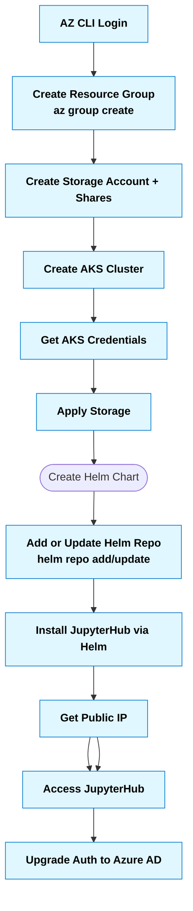

```mermaid
flowchart TD
  A[AZ CLI Login] --> B[Create Resource Group<br/>az group create]
  B --> E[Create Storage Account + Shares]
  E --> F[Create AKS Cluster]
  F --> G[Get AKS Credentials]
  G --> H[Apply Storage]
  H --> X([Create Helm Chart])
  X --> I[Add or Update Helm Repo<br/>helm repo add/update]
  I --> J[Install JupyterHub via Helm]
  J --> K[Get Public IP]
  K --> L[Access JupyterHub]
  K --> L[Access JupyterHub]
  L --> M[Upgrade Auth to Azure AD]

  classDef cli fill:#e0f7ff,stroke:#007acc,color:#000,font-weight:bold;
  class A,B,C,D,E,F,G,H,I,J,K,L,M cli;
```