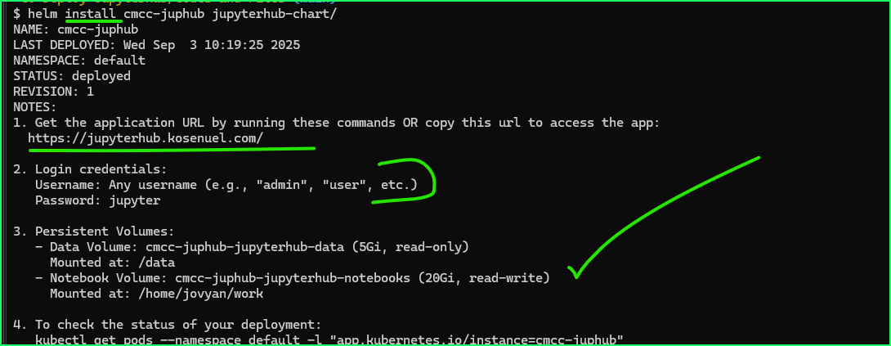
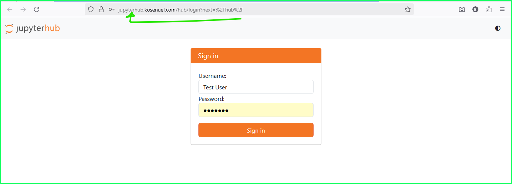
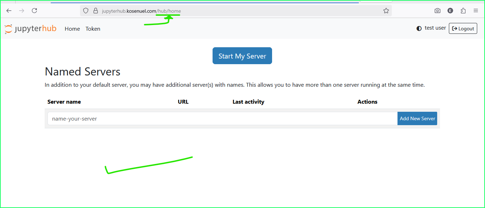
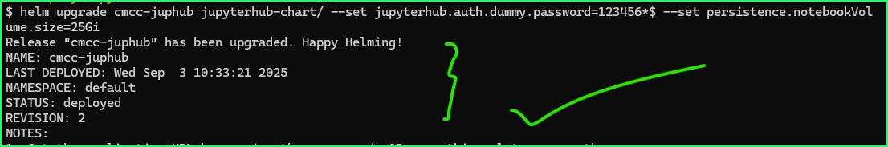
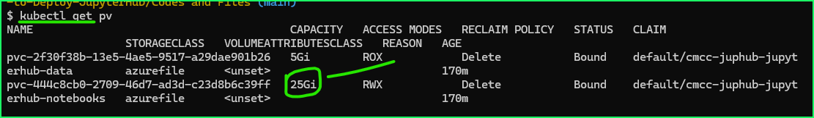
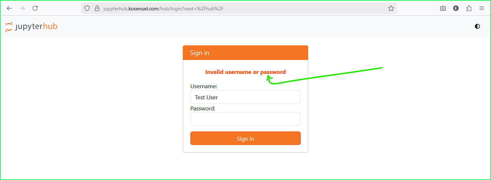
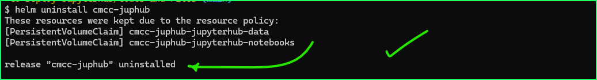
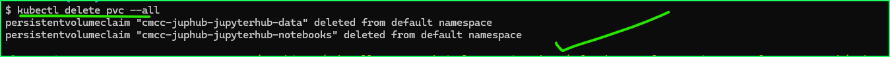

# JupyterHub Helm Chart (CMCC)

This chart deploys a JupyterHub instance to k8s (kubernetes, in our case: Azure Kubernetes) clusters. 

### What it deploys are:
- Dummy authentication (any username + a shared password)
- Deployment for the JupyterHub hub process
- ClusterIP Service exposing port 8000 inside the cluster
- ConfigMap embedding a `jupyterhub_config.py` 
- PersistentVolumeClaim for users’ notebooks at `/home/jovyan/work`
- ServiceAccount for the hub Pod
- Ingress with TLS (works with NGINX Ingress + cert-manager)


## Prerequisites
- Kubernetes cluster (v1.23+) and context configured in `kubectl`
- Helm 3.x
- Ingress Controller (e.g., NGINX Ingress)
- cert-manager installed with a ClusterIssuer named `letsencrypt-prod` (or update values accordingly)
- DNS A record for your hub domain pointing to the Ingress Controller public IP
- Container registry with an image **(in my case, I set the image to be open for anonymous pulling)**


Verify your tools:
```bash
kubectl version --client
helm version
kubectl get nodes
# etc...
```

## Installation Operations

### 1. Install the chart
After pulling this repository to your local environment, navigate into the chart's directory and run:

```bash
helm install <chart-release-name> <chart-directory-name>
# OR
helm install <chart-release-name> <chart-directory-name> --create-namespace --namespace <namespace-name>
```
</br>
*Fig: Installing Chart*

Check status:
```bash
helm status <release-name>
```

### 4. Access the Hub 
Port-forward the Deployment’s port 8000 to your local 8080:
```bash
kubectl -n jupyterhub port-forward deploy/<release-name> 8080:8000
```
Then browse to `http://127.0.0.1:8080`.

OR 
Copy the ingress url for your new app and access it via your web browser like so:
</br>
*Fig: Accessing Jupyterhub*

### 5. Log in (DummyAuthenticator)
- Username: anything (e.g., `alice`)
- Password: default is `jupyter` (from `values.yaml` at `jupyterhub.auth.dummy.password`)

</br>
*Fig: Logging into Jupyterhub*

## Upgrading the Chart
- Change the DummyAuthenticator password and increase PVC size:
```bash
helm upgrade cmcc-juphub jupyterhub-chart/ --set jupyterhub.auth.dummy.password=123456*$ --set persistence.notebookVol
ume.size=25Gi
```
</br>
*Fig: Upgrading Helm*

</br>
</br>
*Fig: Verifying Helm Upgrade*


## Configuration Operations

Below are the most important settings. See `values.yaml` for the full list.

- jupyterhub.replicaCount: Number of Hub Pods
- jupyterhub.image.repository/tag/pullPolicy: Container image settings
- jupyterhub.service.type/port/targetPort: Kubernetes Service configuration
- jupyterhub.resources.requests/limits: CPU and Memory sizing
- jupyterhub.securityContext: Run as non-root user and set FS ownership
- jupyterhub.env:
  - JUPYTERHUB_CRYPT_KEY (from Secret `jupyterhub-secret`)
- persistence.notebookVolume.*: Enable and size the shared notebook volume
- ingress.*: Enable Ingress, set class, domain hosts, and TLS
- serviceAccount.*: Create and/or set a ServiceAccount name
- nodeSelector, tolerations, affinity: Pod scheduling controls

- health checks: to ensure reliability and stability

> #### 🛈 To customize the PVC sizes, mount paths, and any other configurable parameters available, edit the values of the respective parameter and run `helm upgrade <release-name> <chart-directory>`, and helm will auto apply the changes. 


## Uninstall and cleanup
To uninstall your helm chart's deployment run the following command
```bash
helm uninstall <release-name>
```
</br>
*Fig: Uninstalling Helm*

</br>
*Fig: Cleaning up PVCs*
## Troubleshooting 

- **Pod Pending State**: This often indicates issues with Persistent Volume Claim binding. Check `kubectl describe pvc <pvc-name>` and `kubectl get events` for details. Ensure that your AKS cluster has a default storage class or you have specified a valid one in `values.yaml`.
- **JupyterHub Not Accessible via ingress**: Verify Ingress controller logs (`kubectl logs -n <ingress-namespace> <ingress-controller-pod>`) and ensure DNS resolution for your domain is correct.
- **Authentication Failures**: Double-check the password in `values.yaml` for Dummy Authenticator.  
- **Permission Denied on Volumes**: Ensure the `securityContext` in `values.yaml` is correctly configured and matches the user/group IDs expected by the JupyterHub image (e.g., `1000` for `jovyan`).

- **TLS is not issued or Ingress 404s**
  - Confirm `cert-manager` is installed and the ClusterIssuer in annotations exists
  - Make sure the DNS A record points to the Ingress Controller IP
  - Verify Ingress class (e.g., `className: nginx`) matches your controller

- **Image pull errors (ImagePullBackOff)**
  - Ensure `image.repository` and `image.tag` are correct and accessible
  - If private, confirm `imagePullSecrets` includes a valid secret in the same namespace
  - Inspect events: `kubectl -n "<namespace-name>" describe pod <pod>`

- **PVC stays Pending**
  - Ensure the `storageClass` exists in the cluster and supports `ReadWriteOnce` or `ReadWriteMany` (when implementing the post-install hook)
  - Adjust requested `size` to fit available capacity

- **Config changes not applied**
  - Always `helm upgrade` after editing values; the Deployment template includes a checksum of the ConfigMap to trigger rolling restarts
## Thank You!


## References and further reading

- JupyterHub documentation: [jupyterhub.readthedocs.io](https://jupyterhub.readthedocs.io/)
- Helm documentation: [helm.sh/docs](https://helm.sh/docs/)
- Kubernetes concepts: [kubernetes.io/docs](https://kubernetes.io/docs/home/)
- cert-manager: [cert-manager.io/docs](https://cert-manager.io/docs/)
- NGINX Ingress Controller: [ingress-nginx docs](https://kubernetes.github.io/ingress-nginx/)

---
---
---